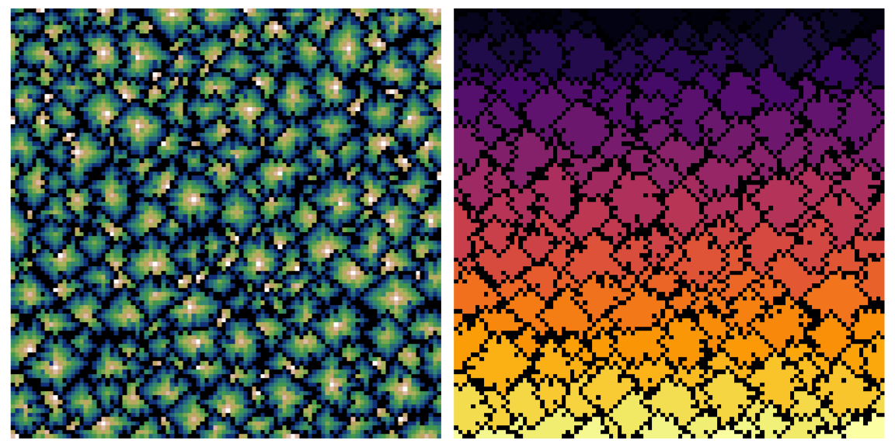

# [Advent of Code 2021](https://adventofcode.com/2021)
Yet another aoc repository! An opportunity for me to start learning Rust :crab:!

```
~~~~~~~~~~~~~~~~~~~~~~~~~~~~~~~~~~~~~~~~~~~~~~~~~   1
```
While in part 1 each element `x[i]` has to be compared with its neighbour `x[i+1]`, in part 2 it has to be compared with its next-next-next-door neighbour `x[i+3]`!

```
~~~~~~~~~~~~~~~~~~~~~~~~~~~~~~~~~~~~~~~~~~~~~~~~~   1
      .. .'   .  ~     .  ~      .         ..''''   2
.. ..  ..              ~ .   .' .         :         3
'     ..       .   .. .   .     .'    ....'         4
           .'   .  . .  .     ..|\..''              5
  '           . ..     '     :                      6
.. ''      ~. .     . ..'  :'                       7
```
In part 1, the cost of moving from $x_i$ to $d$ is $|x_i - d|$. Thus, we want to find $\min_d \sum_{i=1}^N |x_i - d|$ which is a convex optimization problem. The derivative of the cost function is:
$$f'(d) = \sum_i^N -\text{sign}(x_i - d) = \#\{i \mid x_i < d\} - \#\{i \mid x_i > d\}.$$
The minimum is achieved when the derivative of the cost function is zero, that is $\#\{i \mid x_i > d\} = \#\{i \mid x_i < d\}$, thus when $d$ is the median of the $x_i$. We have an analytical solution for part 1! Can a solution also be found for part 2?

In part 2, the cost of moving from $x_i$ to $d$ is $\frac{1}{2}|x_i - d| \cdot (|x_i - d| + 1) = \frac{1}{2}(x_i - d)^2 + \frac{1}{2}|x_i - d|$. This is a mixed cost between a quadratic cost and the previous absolute cost. Here we want to minimize (with relation to $d$) $f(d) = \frac{1}{2}\sum_{i=1}^N[(x_i - d)^2 + |x_i - d|]$. Its derivative (with relation to $d$) is:
$$\begin{align*}
f'(d) &= \sum_{i=1}^N(d - x_i) + \frac{1}{2}\sum_i^N \text{sign}(d - x_i) \\
&= Nd - \sum_{i=1}^N x_i + \frac{1}{2}\#\{i \mid x_i < d\} - \frac{1}{2}\#\{i \mid x_i > d\}
\end{align*}$$
It seems rather hopeless to find a value of d that makes the previous expression zero ... but let's try anyway. By dividing by $N$, the value of $d$ that minimizes $f(d)$ satisfy:
$$d - \bar x + \frac{1}{2N}\left(\#\{i \mid x_i > d\} - \#\{i \mid x_i < d\}\right) = 0,$$
where $\bar x$ denotes the mean of the The final step is to note that $\#\{i \mid x_i > d\} - \#\{i \mid x_i < d\} \in [-N;N]$. Thus $d \in [\bar x - \frac{1}{2}, \bar x + \frac{1}{2}]$. Since $d$ is an integer, $d$ is either $\lfloor \bar x \rfloor$ or $\lceil \bar x \rceil$.

```
  . .     . .        .      '''''.....  ....        8
 .   ...                  :'..  ..    ''    ':      9
```
