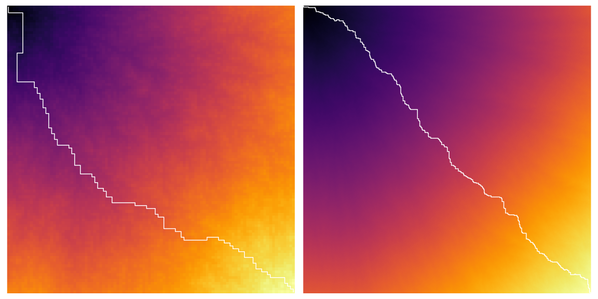

# [Advent of Code 2021](https://adventofcode.com/2021)
Yet another aoc repository! An opportunity for me to start learning Rust :crab:!

```
~~~~~~~~~~~~~~~~~~~~~~~~~~~~~~~~~~~~~~~~~~~~~~~~~   1
```
While in part 1 each element `x[i]` has to be compared with its neighbour `x[i+1]`, in part 2 it has to be compared with its next-next-next-door neighbour `x[i+3]`!

```
 .      ..    .  ~     .  ~      .         ..''''   2
.. ..  ..              ~ .   .' .         :         3
'     ..       .   .. .   .     .'    ....'         4
           .'   .  . .  .     ..|\..''              5
  '           . ..     '     :                      6
.. ''      ~. .     . ..'  :'                       7
```
In part 1, the cost of moving from $x_i$ to $d$ is $|x_i - d|$. Thus, we want to find $\min_d \sum_{i=1}^N |x_i - d|$ which is a convex optimization problem. The derivative of the cost function is:
$$f'(d) = \sum_i^N -\text{sign}(x_i - d) = \#\{i \mid x_i < d\} - \#\{i \mid x_i > d\}.$$
The minimum is achieved when the derivative of the cost function is zero, that is $\#\{i \mid x_i > d\} = \#\{i \mid x_i < d\}$, thus when $d$ is the median of the $x_i$. We have an analytical solution for part 1! Can a solution also be found for part 2?

In part 2, the cost of moving from $x_i$ to $d$ is $\frac{1}{2}|x_i - d| \cdot (|x_i - d| + 1) = \frac{1}{2}(x_i - d)^2 + \frac{1}{2}|x_i - d|$. This is a mixed cost between a quadratic cost and the previous absolute cost. Here we want to minimize (with relation to $d$) $f(d) = \frac{1}{2}\sum_{i=1}^N[(x_i - d)^2 + |x_i - d|]$. Its derivative (with relation to $d$) is:
$$\begin{align*}
f'(d) &= \sum_{i=1}^N(d - x_i) + \frac{1}{2}\sum_i^N \text{sign}(d - x_i) \\
&= Nd - \sum_{i=1}^N x_i + \frac{1}{2}\#\{i \mid x_i < d\} - \frac{1}{2}\#\{i \mid x_i > d\}
\end{align*}$$
It seems rather hopeless to find a value of d that makes the previous expression zero ... but let's try anyway. By dividing by $N$, the value of $d$ that minimizes $f(d)$ satisfy:
$$d - \bar x + \frac{1}{2N}\left(\#\{i \mid x_i > d\} - \#\{i \mid x_i < d\}\right) = 0,$$
where $\bar x$ denotes the mean of the The final step is to note that $\#\{i \mid x_i > d\} - \#\{i \mid x_i < d\} \in [-N;N]$. Thus $d \in [\bar x - \frac{1}{2}, \bar x + \frac{1}{2}]$. Since $d$ is an integer, $d$ is either $\lfloor \bar x \rfloor$ or $\lceil \bar x \rceil$.

```
  . .     . .        .      '''''.....  ....        8
 .   ...                  :'..  ..    ''    ':      9
```


```
.                   .     :   ''  ''''..     '.    10
.     .  .  ..     .   .  :             '..'. :    11
  ~            .     ..  :       :'''..   ..' :    12
```
Recursion is your friend.
```
  ..    .     ...   '  .'    ..''      ''' ...:    13
```

```
         .  .         : ...''  ..':   ....'        14
             .   .    :' ...'''    '''             15
```

```
'.'.            :'. ....'                          16
   :            :  '                               17
```
Let `vx[n]` be the horizontal velocity at step `n` and `x[n]` the horizontal position at step `n`. Similarly let `vy[n]` and `y[n]` be the vertical velocity and position at step `n`. The landing zone is all points inside the rectangle `(xmin, ymin), (xmax, ymax)`.

Starting at `(x[0], y[0]) = (0, 0)`, a valid launch with initial velocity `(vx[0], vy[0])` is such that there exists at least one step `n` for which `xmin ≤ x[n] ≤ xmax` and `ymin ≤ x[n] ≤ ymax`. The velocities are defined as `vy[n+1] = vy[n] - 1` and `vx[n+1] = max(0, vx[n] - 1)`. The positions are moreover recursively defined as `y[n+1] = y[n] + vy[n]` and `x[n+1] = x[n] + vx[n]`. Explicitly, we thus have 
* `vy[n] = vy[0] - n` for all `n`, and
* `vx[n] = vx[0] - n` if `n ≤ vx[0]`; 0 otherwise.

And for the positions:
* `y[n] = n⋅vy[0] - n(n - 1)/2` for all `n`,
* `x[n] = n⋅vx[0] - n(n - 1)/2` if `n ≤ vx[0]`,
* `x[n] = vx[0]² -  vx[0](vx[0] - 1)/2 = vx[0](vx[0] + 1)/2` otherwise.

In the following we assume that `xmax > xmin > 0` and `ymin < ymax < 0`.

#### **Part 1**
In part 1, the goal is to determine the maximum vertical position reachable by a valid launch. For this end, notice that:
* If `vy[0] ≤ 0`, the maximum vertical position is 0. We thus consider positive initial velocity.
* `vy[n]` is positive as long as `n ≤ vy[0]`. Thus the position `y[n]` starts decreasing after this turning point. The maximum value is therefore `y[vy[0]] = vy[0](vy[0] + 1)/2`.
* The vertical position is symmetric at its turning point: when the position becomes decreasing, it takes back exactly the same values in the increasing part of the trajectory. Indeed `y[vy[0] - k] = y[vy[0] + k - 1]`.
* In particular `y[2⋅vy[0] + 1] = y[0]`. This means that at step `2⋅vy[0] + 1`, the vertical position is zero and the velocity is `-vy[0]-1`. At the next step the position will this be `-vy[0]-1`.

Hence, the highest launch is the one for which `-vy[0]-1` is the last row of the landing zone. That is `vy[0] = - ymin - 1`. The highest vertical position of this launch is thus `(- ymin - 1)(- ymin) / 2 = ymin(ymin + 1) / 2`.

#### **Part 2**
We want here to list all the possible valid launches. For this, we need bounds on the minimum and maximum possible velocities to check. It is important to note that `x` and `y` are decoupled, so we can separate them in our thinking.

* At a certain rank, `x` remains at `vx[0](vx[0] + 1)/2`. Then, this maximum value should be larger than `xmin`. Solving the equation gives a lower bound on `vx[0]` which is `sqrt(2⋅xmin + 1/4) - 1/2`. The higher bound is simply `xmax`. (When `vx[0] = xmax`, `x[1] = xmax` and the probe can potentially lands in the landing zone).
* For the `y` velocity, we have already found in part 1 that the higher bound is `-ymin - 1`. And the lower bound is  simply `ymin`.

Now that we have bounded the initial velocities (`sqrt(2⋅xmin + 1/4) - 1/2 ≤ vx[0] ≤ xmax` and `ymin <= vy[0] ≤ -ymin -1`), we can test every possible launch configuration and check it its land in the landing zone.
> We can reduce the number of configurations to be checked by noticing that every initial velocities `(vx[0], vy[0])` for which `xmin ≤ vx[0] ≤ xmax` and `ymin ≤ vy[0] ≤ ymax` will land in the landing zone after the first step! There are as many of these kind of cheated throws as there are slots in the landing zone, that is `(ymax - ymin + 1)(xmax - xmin + 1)`. So we can discard them and focus on these bounds:
> * `sqrt(2⋅xmin + 1/4) - 1/2 ≤ vx[0] ≤ xmin`
> * `ymax <= vy[0] ≤ -ymin -1`

Instead of simulate all launches, we can leverage the explicit definitions of the positions. Indeed recall that a launch is valid if and only if there exists at least one `n` that satisfies `xmin ≤ x[n] ≤ xmax` and `ymin ≤ x[n] ≤ ymax`. Carefully, solving the two inequalities for `n`, gives:
* `n` should be between `vx[0] + 1/2 + sqrt[(vx[0] + 1/2)² - 2⋅xmin]` and "idem with" `xmax`,
* `n` should be between `vy[0] + 1/2 - sqrt[(vy[0] + 1/2)² - 2⋅ymax]` and "idem with" `ymin`.
Checking that these two intervals overlap is straightforward. And if it is the case, the launch is valid!
```
   :          ..'                                  18
```